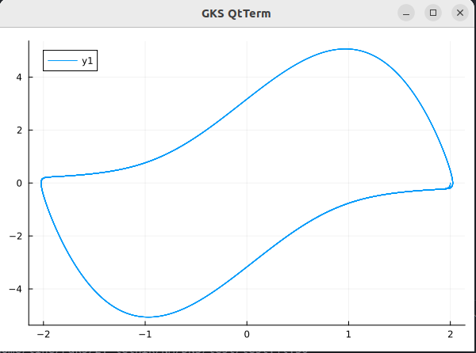

# Perioda limitnega cikla

Poiskati smo morali periodo limitnega cikla za podano diferencialno enačbo.

Definirali smo začetna problema (tip ZacetniProblemNDE) in nato definirali funkcijo, ki resi diferencialno enacbo z uporabo trapezne metode. Funkcija resiTrapez ustvari vektor y za shranjevanje resitev odvisne spremenljivke in vektor x za vrednosti neodvisne spremenljivke. Izracuna dolzino koraka h med sosednjimi tockami. Nato z Eulerjevo metodo izracuna aproksimacijo naslednje vrednosti. Funckija nato vrne vektor y, ki vsebuje aproksimirane vrednosti resitve NDE v tockah

